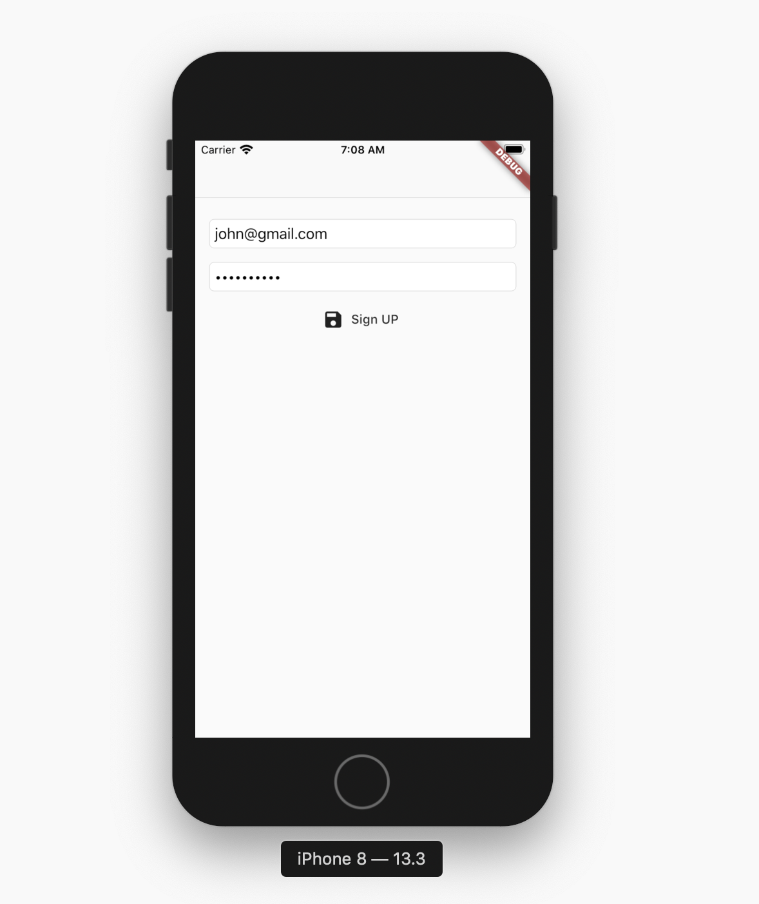

# flutter_nodejs_auth

# Preview

In this project we are getting you set up to connect a Flutter app with NodeJS. Firebase is very popular with app devs right now but I don't think firebase is the way to go. Depending on the project scale it could cost a lot of money and the prices could continue to skyrocket in price. it's not a smart way to go. The truly smart way to go is to use free open source technology to build your app.

NodeJs and MongoDB to the Rescue. With these two technologies you can build everything that Firebase offers. I'm here to show you how to do that just that.

## Setup

The set up is easy.
git clone the code.

Start the emulator for android or iOS and you're ready to rock.

 

## YouTube & Medium article

Here is a YouTube video and medium article to help you understand his code

<footer >
  
 

</footer>
